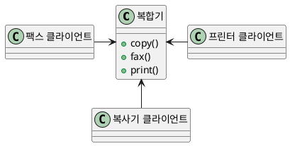
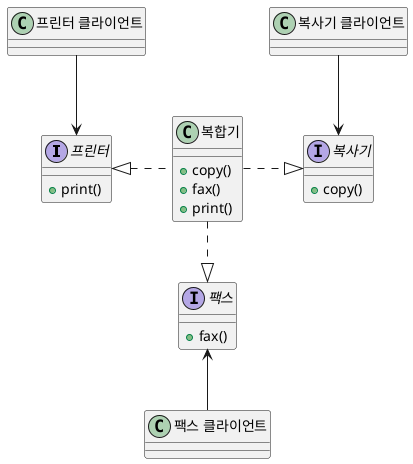

# 인터페이스 분리의 원칙(Interface Segregation Principle, ISP)

<h4 align="center"><I>"한줄 요약 "</I></h4>
<h6 align="center">ISP는 인터페이스를 클라이언트에 특화되도록 분리시키라는 원칙</h6>

## 올바른 인터페이스 분리의 원칙 예시

위와같이 프린터, 팩스, 복사기 기능이 모두 포함된 복합기를 생각해본다면 아래와 같은 문제점이 생긴다.
* 복합기 기능을 제공하는 클래스가 매우 비대해질 가능성이 크다
* 하지만 매우 비대해진 클래스의 모든 기능을 클라이언트가 동시에 사용하는 경우는 거의 없다.
* 만약 프린터 기능만 사용하는 클라이언트가 팩스 기능의 변경으로 발생하는 문제의 영향을 받을수도 있다.

따라서 **클라이언트와 무관하게 발생한 변화로 클라이언트 자신이 영향을 받지 않기위해서** 범용의 인터페이스보다는 **클라이언트에 특화된 인터페이스를 사용해야 한다.**

위와 같이 복합기를 사용하는 객체들마다 자신이 관심을 갖는 메서드 들만 있는 인터페이스를 제공받도록 설계했다. 이러면 인터페이스가 **일종의 방화벽 역할**을 수행해 클라이언트는 **자신이 사용하지 않는 메서드에 생긴 변화로 인한 영향을 받지 않게 된다.**

## 단일 책임 원칙(SRP)와 인터페이스 분리의 원칙(ISP)의 관계
* SRP에 따라 여러 책임이 아닌 단일 책임을 갖는 여러 클래스로 분할하고 각자의 인터페이스를 제공한다면 ISP도 만족할수 있다.
* **하지만 SRP를 만족하더라도 ISP를 반드시 만족한다고 할 수 없다.**

##### 예시
  * 게시판 기능 (Dashboard 클래스, CRUD(Create,Read,Update,Delete) 메서드)
    * 관리자 : CRUD 사용 가능
    * 클라이언트 : CRU 사용 가능 (Delete 기능 X)
    
Dashboard 클래스는 **게시판 기능에 관련된 책임을 지기 때문에 SRP를 만족한다.** 하지만 클라이언트의 입장에서는 Delete 메서드를 사용하지 않아도 Dashboard 클래스의 모든 메서드가 들어가있는 인터페이스를 사용하게 되면 **클라이언트에 상관없이 사용되기 때문에 ISP에 위배 된다.**

---

### 참고 Plant UML Code

