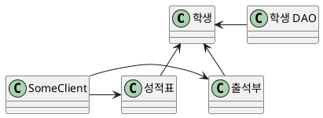
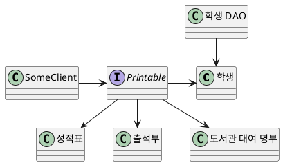

# 개방폐쇄의 원칙 (Open Close Principle, OCP)

<h4 align="center"><I>"한줄 요약 "</I></h4>
<h6 align="center">OCP란 기존의 코드를 변경하지 않으면서 기능을 추가할 수 있도록 설계가 되어야 한다는 뜻이다.</h6>

## 개방-폐쇄 원칙
예를 들어 성적표나 출석부를 출력하는 기능을 SomeClient에서 사용하게끔 만들어보자

    

만약 성적표, 출석부 외에 도서관 대여 명부를 출력하는 기능을 추가하려면 도서관 대여 명부 클래스를 만들고 SomeClient에서 사용하게끔 하면 된다. 하지만 새로운 기능을 추가하기 위해 **기존의 코드를 변경해야 하기 때문에 OCP를 위반하게 된다.**

## OCP를 만족하는 설계
위에 설계한 기능을 OCP를 만족하는 설계로 변경해보자 먼저 변하는 것과 변하지 않는 것으로 구분해야한다.

* 변하는 것 : 쉽게 변할수 있게 해야 한다.
* 변하지 않는 것 : 변하지 않아야 할 것은 변하는 것에 영향을 받지 않게 해야한다. 

위의 기준에 따라 **변하는 것은 성적표, 도서관 대여 명부, 출석부 처럼 기록을 출력하는 매체이다.**  또한 여기서 **변하지 않는 것은 매체를 출력한다는 사실이다.** 따라서 새로운 출력 매체가 추가되더라도 기존의 클래스가 영향을 안받게 하려면 인터페이스를 사용하여 구체적인 출력 매체를 캡슐화 해 처리하도록 해야한다.
 
  

    
  

---

### 참고 Plant UML Code

